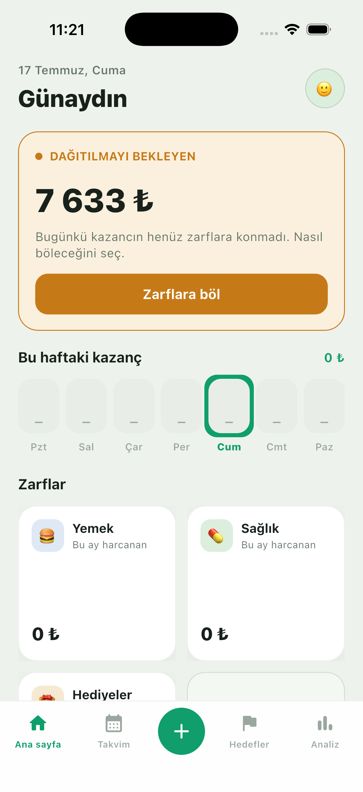
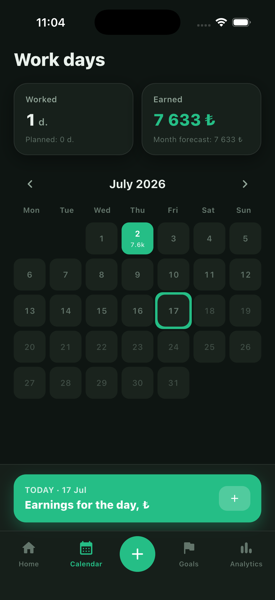
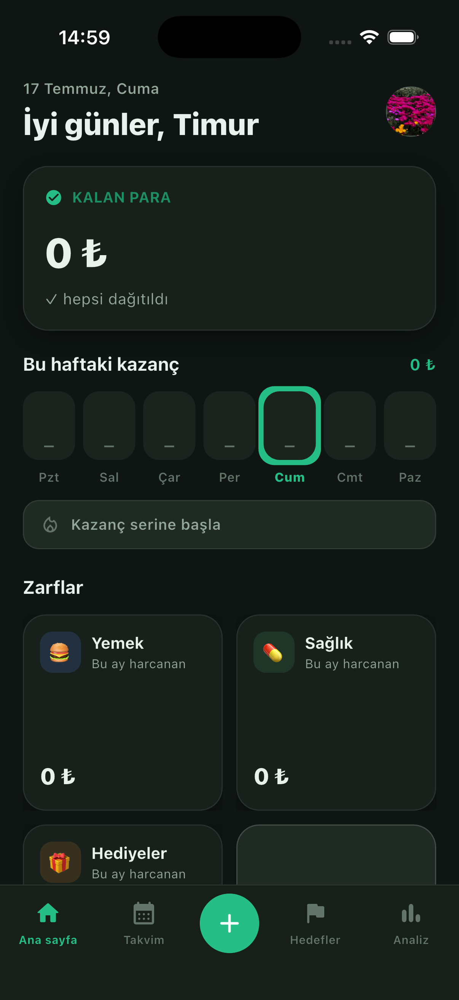

# Budgy 💚

**Envelope budgeting for people who earn daily.** Log what you make each day, split it into
envelopes (rent, groceries, savings…), and always know where every lira is going — instead of
staring at one big "total balance."

Built with **Flutter** + **Firebase**, fully themed for light & dark, and available in **3 languages**
(Turkish, Russian, English).

<p align="left">
  
  
  
</p>

## Why it's different

Most budget apps center on your total balance. Budgy centers on your **daily rhythm** — the home
screen leads with the money waiting to be distributed and a weekly earnings heat-strip, because for
a daily earner the real job is *splitting today's income into envelopes*.

## Features

- **Daily earnings + work-days calendar** — mark the days you worked and how much you made; a monthly
  heat-map shows your earning rhythm at a glance.
- **Envelope budgeting** — distribute income across spending envelopes and savings goals; every
  expense comes out of a specific envelope.
- **Spending insights** — donut breakdown, month-over-month comparison, and a "pace" forecast that
  warns when an envelope is on track to go over budget.
- **Earning streak** 🔥 and a **weekly summary** notification.
- **Recurring bills** dashboard (monthly total + upcoming due dates).
- **Home-screen widget** (iOS WidgetKit) — today's earnings, money left, and streak.
- **Multi-currency** (₺ / $ / € / ₽), **light/dark theme**, and **TR / RU / EN** localization.
- **Auth**: anonymous, email/OTP, password reset, and biometric (Face ID) lock.

## Tech stack

| Area | Choices |
| --- | --- |
| Framework | Flutter · Dart |
| State | Riverpod (`StreamProvider`, `ThemeExtension` design tokens) |
| Backend | Firebase — Authentication + Cloud Firestore |
| Local | flutter_local_notifications, home_widget, local_auth |
| Design | Custom "Sıcak Defter" token system, light + dark, 3-language i18n |

## Architecture

Feature-first structure under `lib/features/*` (envelopes, transactions, workdays, insights, auth,
stats, goals, reminders, profile). Design tokens live in `lib/core/tokens.dart` as a `BudgyColors`
`ThemeExtension`, so every screen reads colors through `context.budgy` and both themes stay in sync.

## Running it

```bash
flutter pub get
flutter run
```

> Firebase config files (`firebase_options.dart`, `GoogleService-Info.plist`,
> `google-services.json`) are intentionally **not committed**. Add your own Firebase project to run.

---

Built by [Timur Batyrkul](https://github.com/timurbatyrkul001).
