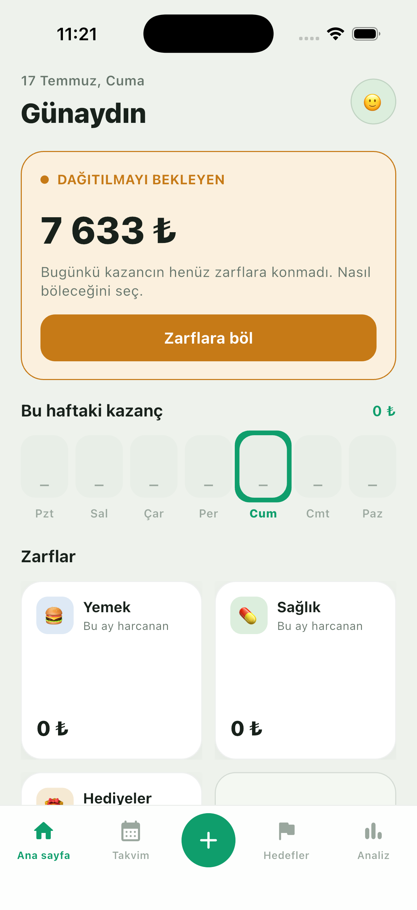
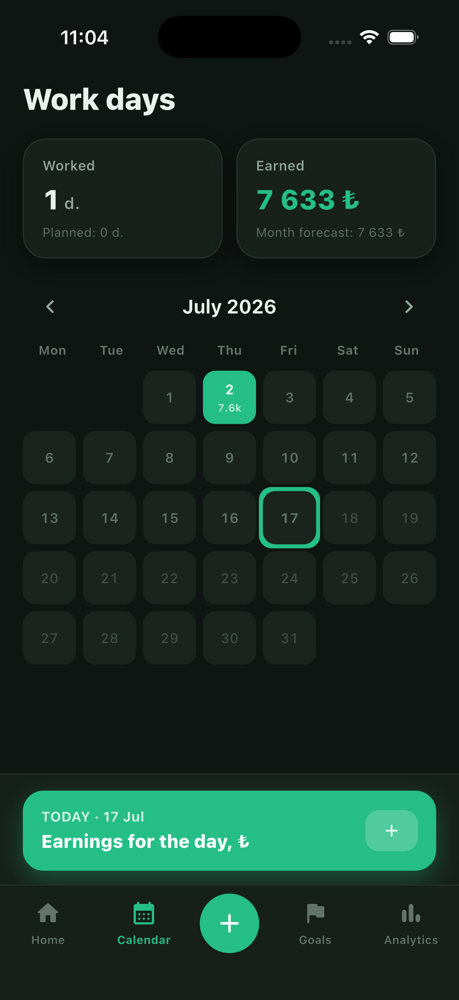
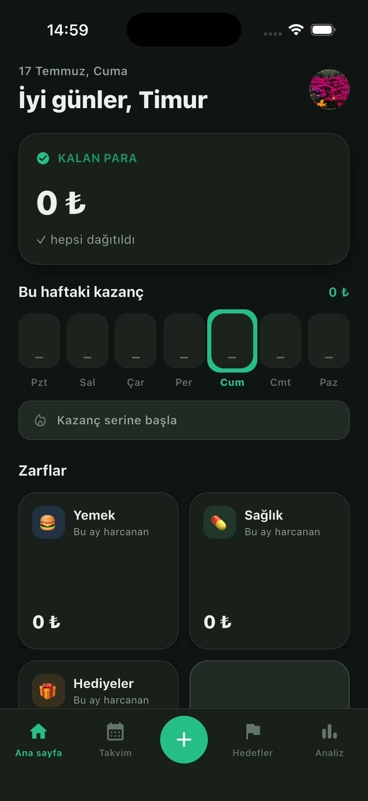

# Budgy 💚

**Envelope budgeting for people who earn daily.** Log what you make each day, split it into
envelopes (rent, groceries, savings…), and always know where every lira is going — instead of
staring at one big "total balance."

Built with **Flutter** + **Firebase**, in a single light "paper" theme, and available in
**3 languages** (Turkish, Russian, English).

<p align="left">
  
  
  
</p>

## Why it's different

Most budget apps center on your total balance. Budgy centers on your **daily rhythm** — the home
screen leads with the money waiting to be distributed and a weekly earnings heat-strip, because for
a daily earner the real job is *splitting today's income into envelopes*.

## Features

- **Daily earnings + work-days calendar** — mark the days you worked and how much you made; a monthly
  heat-map shows your earning rhythm at a glance.
- **Envelope budgeting** — distribute income across spending envelopes and savings goals; every
  expense comes out of a specific envelope.
- **Spending insights** — donut breakdown, month-over-month comparison, and a "pace" forecast that
  warns when an envelope is on track to go over budget.
- **Earning streak** 🔥 and a **weekly summary** notification.
- **Recurring bills** dashboard (monthly total + upcoming due dates).
- **Home-screen widget** (iOS WidgetKit) — today's earnings, money left, and streak.
- **Multi-currency accounts** — add the cards you actually use (a Turkish card in ₺, an
  Azerbaijani one in ₼). Every expense stores the exchange rate **frozen at the moment it was
  entered**, so last month's totals never shift when the rate moves.
- **TR / RU / EN** localization and an increase-contrast accessibility setting.
- **Auth**: anonymous by default, Google sign-in (links to the anonymous account, so nothing is
  lost), password reset by email. Sign in with Apple is wired but needs the Apple Developer
  capability enabled.

## Tech stack

| Area | Choices |
| --- | --- |
| Framework | Flutter · Dart |
| State | Riverpod (`StreamProvider`, `ThemeExtension` design tokens) |
| Backend | Firebase — Authentication + Cloud Firestore |
| Local | flutter_local_notifications, home_widget |
| Design | Poster-style token system (paper + ink + green), 3-language i18n |

## Architecture

Feature-first structure under `lib/features/*` (envelopes, transactions, accounts, workdays,
insights, auth, stats, goals, reminders, settings).

Colors live in two places, which is worth knowing before you read the code: `lib/core/tokens.dart`
holds `BudgyColors`, a `ThemeExtension` read at runtime via `context.budgy`, while
`lib/core/ex_style.dart` holds `Ex`, compile-time constants used by most screens. The split is
historical — the app moved from a dark theme to the current paper one and only the values were
changed, not the type. Moving `Ex` to the runtime palette is the open piece of work that would let
the app offer real theme choices.

## Not done yet

Stated plainly so the feature list above can be trusted:

- **Subscriptions** — the paywall and the Pro gate exist, but no purchase is made. RevenueCat is
  not wired up; Pro is granted manually in Firestore.
- **Theme choice** — the onboarding offers four "worlds" and saves the pick, but the app renders
  in one light theme (see Architecture).
- **AI entry** — receipt scanning and voice entry call a Cloud Function that proxies Anthropic.
  The function is written but not deployed.
- **Analytics** — Crashlytics is in; there is no product analytics, so drop-off is not measured.

## Running it

```bash
flutter pub get
flutter run
```

> Firebase config files (`firebase_options.dart`, `GoogleService-Info.plist`,
> `google-services.json`) are intentionally **not committed**. Add your own Firebase project to run.

---

Built by [Timur Batyrkul](https://github.com/timurbatyrkul001).
